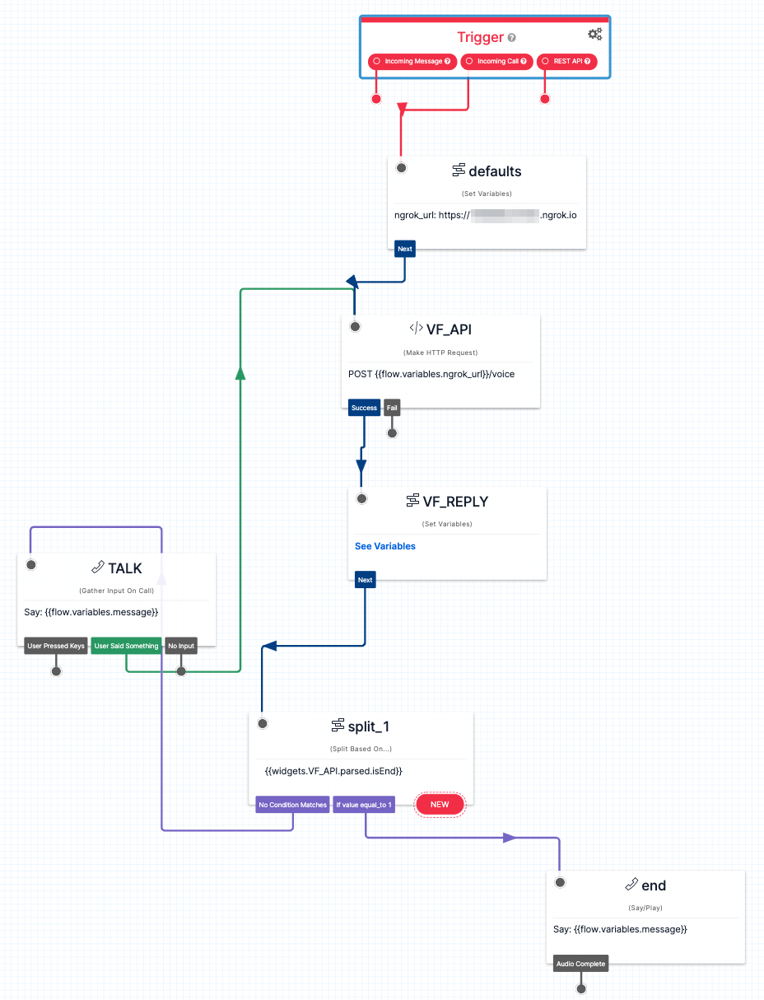

# voiceflow-twilio-en

# **This repository has been archived **

**This repository has been archived because Voiceflow SDK has been replaced with Dialog Management API and obsoleted now. These codes may not work. (I heard that a New SDK suitable for Dialog Management API will be released in future.) **

## About

demo for node.js/express server for running a Twilio IVR chatbot with Voiceflow SDK.



## Prerequisites

- node.js envrionment
- ngrok
- Twilio account
  - For getting a phone number, you may need to submit informations for identity to Twilio in advanced. See https://www.twilio.com/guidelines/regulatory

## Usage

Clone this repository.

```
$ git clone https://github.com/kun432/voiceflow-twilio-en.git
$ cd voiceflow-twilio-en
$ npm install
```

On Voiceflow, 

- Import `VoiceflowBurger.vf` in this repository to your workspace, then test and train your model once.
- Get an API key for your workspace.
- Get a Version ID for the project you just imported above.

Edit `config.json` and replace the following with your API key and Version ID.

```
{
    "versionID": "XXXX",
    "apiKey": "VF.XXXX.XXXX"
}
```

Start server and ngrok.

```
node .
ngrok http 3000
```

ngrok will generate temporary URLs, for HTTP and for HTTPS. Twilio Stduio need HTTPS.

Open `twilio-studio.json` and replace ngrok URL with your HTTPS one.

```
      "properties": {
        "variables": [
          {
            "value": "https://XXXXXXXXXXXX.ngrok.io", // HERE
            "key": "ngrok_url"
          }
        ],
```

On Twilio,

- On "Studio",
  - Create a new flow.
  - Choose "Import from JSON".
  - Open `twilio-studio.json` in this repository and copy all.
  - Overwrite paste inside the form.
  - After importing, Publish your flow.
- On "Phone Numbers",
  - Get a phone number.
  - Set its webhook to your Studio flow. 
